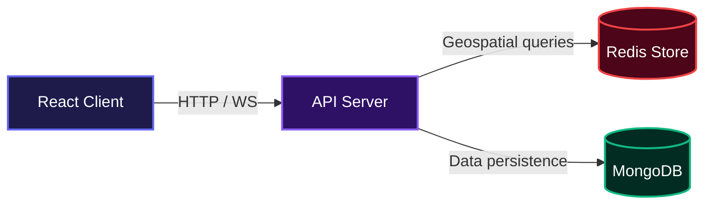
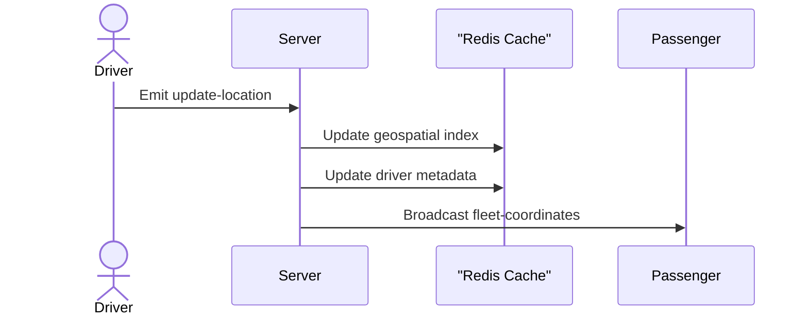
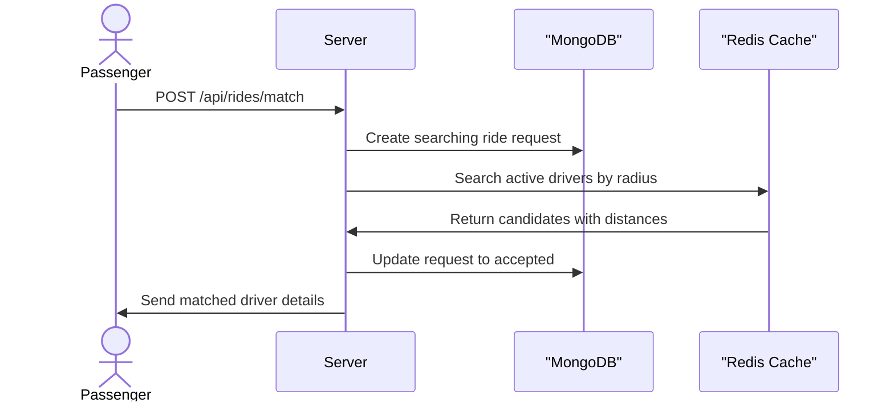

# Geodash

Geodash helps developers build real-time ride-sharing platforms by providing a complete passenger booking and fleet tracking system. It takes live vehicle coordinates, processes them for proximity matching, and broadcasts the fleet movements to an interactive dashboard without noticeable delay.

## System Architecture



## Repository Layout

```text
GeoDash/
├── backend/              Express, Socket.IO, Redis and MongoDB integration
├── geodashFrontend/      React/Vite dashboard
├── docker-compose.yml     Backend, MongoDB, Redis and mock driver stack
├── .env.example           Docker environment template
└── README.md
```

## Local Installation

Clone the repository:

```bash
git clone https://github.com/olusanyaemmanuelpg-sudo/Geodash.git
cd Geodash
```

Create the root Docker environment file:

```bash
cp .env.example .env
chmod 600 .env
```

Replace the placeholder passwords in `.env`. For local frontend development, use:

```env
FRONTEND_ORIGINS=http://localhost:5173,http://localhost:5174
```

Start the backend, database, cache, and mock simulator:

```bash
docker compose up -d --build
```

Start the frontend in a second terminal:

```bash
cd geodashFrontend
npm install
npm run dev
```

Open `http://localhost:5173`. The mock simulator automatically connects to the backend through the Docker network and publishes 25 simulated drivers.

Check service status and logs:

```bash
docker compose ps
docker compose logs -f backend mock-simulator
```

Stop the stack without deleting database data:

```bash
docker compose down
```

Do not use `docker compose down -v` unless you intentionally want to delete the MongoDB and Redis volumes.

## Frontend Configuration

The frontend reads `geodashFrontend/.env` through Vite:

```env
VITE_API_URL=http://localhost:3000
```

For a VPS without a domain:

```env
VITE_API_URL=http://YOUR_VPS_IP:3000
```

For a domain behind HTTPS:

```env
VITE_API_URL=https://api.yourdomain.com
```

Run `npm run build` after changing `VITE_API_URL`; Vite embeds the value during the build. Never put database or Redis credentials in the frontend `.env`.

## Production Deployment

On the VPS, clone the repository and create the root `.env`:

```bash
git clone https://github.com/olusanyaemmanuelpg-sudo/Geodash.git
cd Geodash
cp .env.example .env
chmod 600 .env
nano .env
```

Use real production values:

```env
REDIS_PASSWORD=your-strong-redis-password
MONGO_ROOT_USERNAME=geodash-admin
MONGO_ROOT_PASSWORD=your-strong-mongo-password
FRONTEND_ORIGINS=https://yourdomain.com,https://www.yourdomain.com
```

Start the stack:

```bash
docker compose up -d --build
docker compose ps
```

MongoDB and Redis communicate with the backend over the private Docker network and do not expose their database ports publicly. Only the backend port is published by the default Compose file.

The mock simulator is intentionally part of the stack for development and demo environments. It connects internally using `SERVER_URL=http://backend:3000`; this is different from the public frontend API URL.

For a production frontend, set `VITE_API_URL` to the public backend URL and rebuild the frontend before deploying its `dist/` directory.

If an existing MongoDB volume was created before authentication was enabled, do not run `docker compose down -v`. Create the MongoDB admin user or migrate the data first.

## Usage

Once the backend is running via Docker and the frontend is running locally, navigate to `http://localhost:5173` in a web browser. The dashboard will automatically connect to the backend WebSocket server and begin streaming live vehicle locations simulated by the mock service.

To connect a custom driver client and broadcast telemetry, use the socket.io-client library with the following payload structure:

```javascript
import { io } from 'socket.io-client';

const socket = io('http://localhost:3000', {
  query: {
    userId: 'driver_123',
    role: 'driver',
  },
});

socket.emit('update-location', {
  driverId: 'driver_123',
  longitude: -122.4194,
  latitude: 37.7749,
  bearing: 90,
  status: 'active',
});
```

Passengers connect similarly using the `passenger` role and listen for the `fleet-coordinates` event to update their local map state.

## Features

- **Real-Time Fleet Tracking**: Ingests high-frequency location data from drivers and broadcasts it to all connected clients for smooth map interpolation.



- **Geospatial Ride Matching**: Locates the nearest available driver within a specified radius using in-memory geospatial queries, falling back to a Haversine distance calculation if the cache is unavailable.



- **Dynamic Ride Tiers**: Offers multiple vehicle classes with calculated pricing and estimated times of arrival.
- **Interactive Mapping**: Provides a sleek map interface with precise pickup and destination selection powered by OpenStreetMap reverse geocoding.
- **Telemetry Dashboard**: Displays live system health metrics including cache ingestion latency, active driver counts, and database synchronization windows.

## Technologies Used

| Technology   | Description                                       |
| ------------ | ------------------------------------------------- |
| Node.js      | Backend runtime environment                       |
| Express      | HTTP API framework                                |
| Socket.io    | Real-time bidirectional event-based communication |
| Redis        | In-memory data store for geospatial queries       |
| MongoDB      | Persistent document database                      |
| React        | Frontend UI library                               |
| Vite         | Frontend build tooling                            |
| Tailwind CSS | Utility-first styling                             |
| Leaflet      | Interactive maps                                  |
| Docker       | Container orchestration                           |

## API Documentation

### Environment Variables

- `REDIS_PASSWORD`: Secure password for the Redis instance.
- `MONGO_ROOT_USERNAME`: Administrative username for MongoDB.
- `MONGO_ROOT_PASSWORD`: Administrative password for MongoDB.
- `FRONTEND_ORIGINS`: Comma-separated list of allowed frontend origins for CORS.
- `PORT`: Port for the Express server to listen on.
- `REDIS_HOST_URL`: Hostname of the Redis instance.
- `REDIS_PORT`: Port of the Redis instance.
- `MONGODB_URL`: Full connection string for the MongoDB instance.

### REST Endpoints

#### GET /

**Description**: Health check endpoint to verify the server is running.

**Request**:
No body required.

**Response**:

```text
Hello, World!
```

#### POST /api/rides/match

**Description**: Finds the nearest available driver to the provided coordinates within a specified radius and persists the ride request.

**Request**:

```json
{
  "latitude": 37.7749,
  "longitude": -122.4194,
  "destination": {
    "latitude": 37.8044,
    "longitude": -122.2712
  },
  "passengerId": "demo-passenger",
  "fare": 14.2,
  "radiusKm": 5
}
```

**Response**:

```json
{
  "driverId": "driver_123",
  "distanceKm": 1.2,
  "longitude": -122.418,
  "latitude": 37.7755,
  "status": "idle",
  "rideRequestId": "60d5ecb74d6bb8928746d5c5"
}
```

**Errors**:

- 400: Valid pickup latitude and longitude are required.
- 404: No available driver found nearby.
- 503: Matching service is temporarily unavailable.

#### GET /api/rides/:rideRequestId

**Description**: Retrieves the details and current status of a specific ride request.

**Request**:
Path parameter requires a valid MongoDB ObjectId.

**Response**:

```json
{
  "_id": "60d5ecb74d6bb8928746d5c5",
  "passengerId": "demo-passenger",
  "driverId": "driver_123",
  "status": "ACCEPTED",
  "pickupLocation": {
    "type": "Point",
    "coordinates": [-122.4194, 37.7749]
  },
  "dropoffLocation": {
    "type": "Point",
    "coordinates": [-122.2712, 37.8044]
  },
  "fare": 14.2,
  "createdAt": "2023-10-01T12:00:00.000Z",
  "updatedAt": "2023-10-01T12:00:05.000Z"
}
```

**Errors**:

- 400: Invalid ride request ID.
- 404: Ride request not found.
- 503: Ride history is temporarily unavailable.

## Contributing

Contributions are welcome. Please open an issue first to discuss what you would like to change. Ensure that you update tests and documentation as appropriate before submitting a pull request.

## Author Info

- LinkedIn: https://linkedin.com/in/olusanya-emmanuel-21546536a

[](https://nodejs.org/)
[](https://react.dev/)
[](https://www.docker.com/)
[](https://redis.io/)
[](https://www.mongodb.com/)

[](https://dokugen.samueltuoyo.com)
