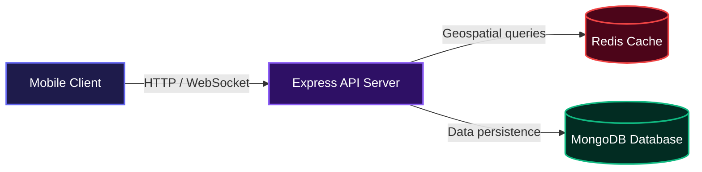
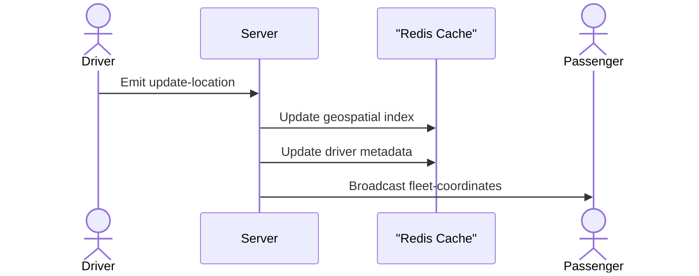
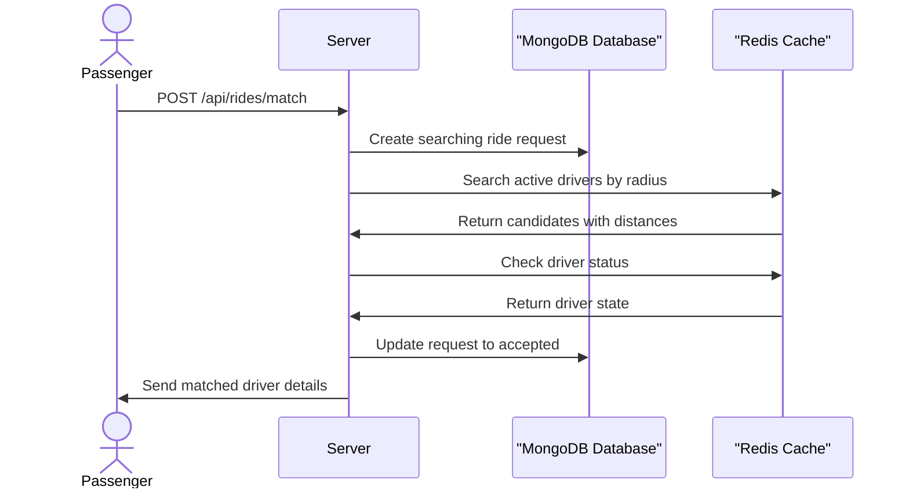

# Ride Matching (Uber) Backend Service

Alway's wondering how uber works, after some call with mentors and obviously my beloved gemini 😅, I worked on this project. It simulates uber real-time transportation platforms by tracking live driver locations and matching them with passengers based on proximity. It ingests high-speed telemetry data from driver devices and broadcasts fleet coordinates to users without noticeable delay.

## System Architecture



## Installation

Follow these instructions to set up the project locally. 

1. Clone the Repository:

```bash
git clone <repository-url>
```

2. Install dependencies:

```bash
npm install
```

3. Create a `.env` file in the root directory and configure the environment variables:

```bash
PORT=3000
REDIS_HOST_URL=127.0.0.1
REDIS_PORT=6379
REDIS_PASSWORD=your_secure_password
FRONTEND_ORIGINS=http://example.com,https://app.example.com
```

4. Start the development server:

```bash
npm run dev
```

Alternatively, you can run the application using Docker:

```bash
docker build -t ride-matching-backend .
docker run -p 3000:3000 --env-file .env ride-matching-backend
```

## Usage

Once the server is running, you can interact with the HTTP endpoints for ride matching or connect via WebSockets to stream location data.

To connect a driver client and broadcast telemetry, you can use the socket.io-client library like this:

```javascript
import { io } from 'socket.io-client';

const socket = io('http://localhost:3000', {
  query: {
    userId: 'driver_123',
    role: 'driver',
  },
});

socket.emit('update-location', {
  driverId: 'driver_123',
  longitude: -122.4194,
  latitude: 37.7749,
  bearing: 90,
  status: 'active',
});
```

Passengers can connect similarly and listen for the `fleet-coordinates` event to see drivers moving on a map in real time.

## Features

- **High-Speed Telemetry Ingestion**: Captures location, bearing, and status updates from drivers via persistent WebSocket connections, calculating latency for every packet.



- **Geospatial Ride Matching**: Quickly finds the nearest available driver using fast radius queries, checking status metadata to ensure passengers only match with idle drivers.



- **Ride Lifecycle Tracking**: Persists ride requests, pickup coordinates, dropoff coordinates, and fare estimates to a database. It automatically transitions ride states from searching to accepted the moment a driver is matched.
- **Resilient In-Memory Fallback**: Automatically switches to an active in-memory Map of driver positions to calculate Haversine distances if the caching layer experiences downtime.
- **Live Fleet Broadcasting**: Pushes active fleet coordinates out to all connected clients so passengers can view accurate vehicle positions on their screens.

## Technologies Used

| Technology | Badge |
| ---------- | ----- |
| Node.js    | [](https://nodejs.org/) |
| Express    | [](https://expressjs.com/) |
| Socket.io  | [](https://socket.io/) |
| Redis      | [](https://redis.io/) |
| MongoDB    | [](https://www.mongodb.com/) |
| Docker     | [](https://www.docker.com/) |

## API Documentation

### Environment Variables

The server requires the following environment variables to run properly:

- `PORT`: The port the Express server binds to. Defaults to `3000`.
- `REDIS_HOST_URL`: The hostname or IP address of the cache server. Defaults to `127.0.0.1`.
- `REDIS_PORT`: The port for the cache server. Defaults to `6379`.
- `REDIS_PASSWORD`: The authentication password for the cache server.
- `FRONTEND_ORIGINS`: Comma-separated list of allowed frontend origins for CORS and Socket.io. Localhost Vite origins are allowed automatically in development.

### REST Endpoints

#### GET /

**Description**: Health check endpoint to verify the server is running.

**Response**:

```text
Hello, World!
```

#### POST /api/rides/match

**Description**: Finds the nearest available driver to the provided coordinates within a specified radius.

**Request**:

```json
{
  "latitude": 37.7749,
  "longitude": -122.4194,
  "destination": {
    "latitude": 37.8044,
    "longitude": -122.2712
  },
  "passengerId": "demo-passenger",
  "fare": 14.2,
  "radiusKm": 5
}
```

**Response**:

```json
{
  "driverId": "driver_123",
  "distanceKm": 1.2,
  "longitude": -122.418,
  "latitude": 37.7755,
  "status": "idle",
  "rideRequestId": "60d5ecb74d6bb8928746d5c5"
}
```

**Errors**:

- 400: Valid pickup latitude and longitude are required.
- 404: No available driver found nearby.
- 503: Matching service is temporarily unavailable.

#### GET /api/rides/:rideRequestId

**Description**: Retrieves the details and current status of a specific ride request.

**Response**:

```json
{
  "_id": "60d5ecb74d6bb8928746d5c5",
  "passengerId": "demo-passenger",
  "driverId": "driver_123",
  "status": "ACCEPTED",
  "pickupLocation": {
    "type": "Point",
    "coordinates": [-122.4194, 37.7749]
  },
  "dropoffLocation": {
    "type": "Point",
    "coordinates": [-122.2712, 37.8044]
  },
  "fare": 14.2,
  "createdAt": "2023-10-01T12:00:00.000Z",
  "updatedAt": "2023-10-01T12:00:05.000Z"
}
```

**Errors**:

- 400: Invalid ride request ID.
- 404: Ride request not found.
- 503: Ride history is temporarily unavailable.

### WebSocket Events

**Connection Query Parameters**:

- `userId`: Unique identifier for the connecting client.
- `role`: Client role, either `driver` or `passenger`.

**Incoming Events (from Driver)**:

- `update-location`: Expects a payload containing `driverId`, `longitude`, `latitude`, `bearing`, and `status`. Updates the driver's current position in the system.

**Outgoing Events (to Clients)**:

- `fleet-coordinates`: Broadcasts driver location updates to clients. The payload includes the driver's telemetry data along with a `latencyMs` field showing network processing delay.

## Contributing

We welcome community contributions. Feel free to fork the repository, make your changes, and submit a pull request. Make sure to test your code locally before submitting to ensure it does not break existing ride-matching functionality.

## Author

- LinkedIn: [https://linkedin.com/in/olusanya-emmanuel-21546536a](https://linkedin.com/in/olusanya-emmanuel-21546536a)

[](https://dokugen.samueltuoyo.com)