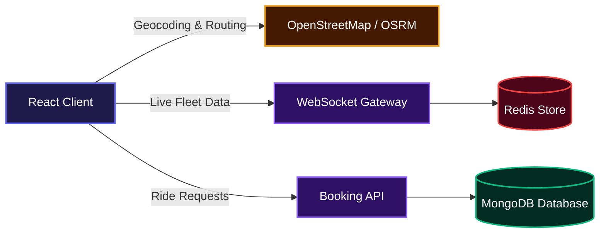
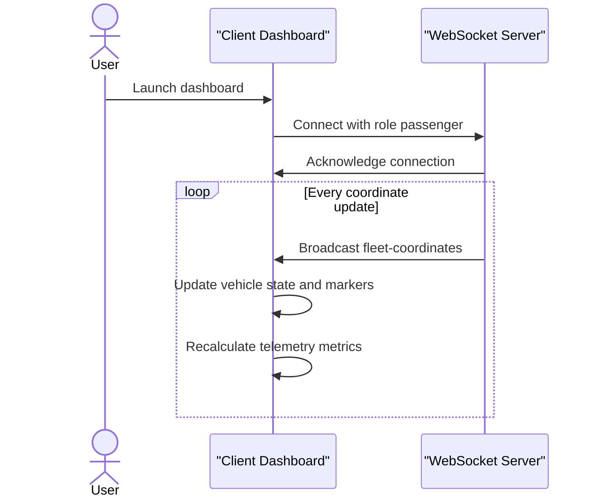
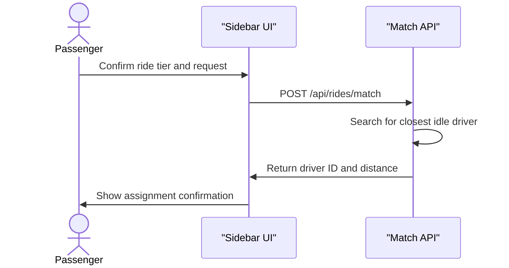

# Geodash

Geodash helps developers build ride-sharing interfaces by providing a complete passenger booking and fleet tracking dashboard. It takes live vehicle coordinates and translates them into an interactive map, allowing teams to monitor fleet telemetry and process ride requests in real time. The interface provides straightforward mapping, address resolution, and dispatch functionality right out of the box.

## System Architecture



## Features

### Interactive Fleet Mapping

The application renders a custom street map using Leaflet, overlaying high-performance animated vehicle markers. As location data streams in, the vehicles smoothly interpolate to their new coordinates to prevent visual stuttering. Users can tap anywhere on the map to set precise pickup and destination points.

### Live Telemetry and Synchronization

A dedicated telemetry engine tracks system latency, active driver counts, and database synchronization windows. It maintains a persistent WebSocket connection to ensure the dashboard reflects the exact state of the fleet.



### Dynamic Ride Booking

Passengers can select from multiple ride tiers with calculated pricing and estimated times of arrival. The booking system takes the reverse-geocoded coordinates and dispatches a matching request to the nearest available driver.



## API Documentation

The client application integrates with backend services to provide booking functionality. Below are the endpoints expected by the frontend.

#### POST /api/rides/match

**Description**: Finds the closest available driver based on the passenger pickup coordinates and assigns them to the ride.

**Request**:

```json
{
  "latitude": 37.7885,
  "longitude": -122.4014,
  "destination": {
    "latitude": 37.7955,
    "longitude": -122.3937
  },
  "fare": 14.2
}
```

**Response**:

```json
{
  "driverId": "demo-1",
  "distanceKm": 1.25
}
```

**Errors**:

- 400: Bad request if coordinates are missing.
- 404: No driver found available in the requested vicinity.

### Environment Variables

The frontend relies on the following environment variables:

- `VITE_API_URL`: The base URL for the backend API and WebSocket server. Defaults to `http://localhost:3000` if not provided.

## Installation

Follow these steps to set up the development environment on your local machine.

Clone the repository:

```bash
git clone <repository-url>
```

Navigate to the project directory:

```bash
cd geodash
```

Install the required dependencies:

```bash
npm install
```

Start the Vite development server:

```bash
npm run dev
```

## Usage

Once the development server is running, open your browser and navigate to `http://localhost:5173`.

The interface is split into three main components:

1. **The Map**: Drag to pan around the city. Click anywhere to update your currently active selection marker (pickup or destination).
2. **The Booking Panel**: Located on the left side, this panel allows you to toggle between setting the pickup and destination points. You can select different vehicle tiers (Standard, Comfort, Executive, Logistics) and click the request button to mock a booking flow.
3. **The Telemetry Panel**: Located in the top right, this widget displays simulated server health metrics. You can toggle dark mode from this panel or pause the live fleet data stream for inspection.

## Technologies Used

| Category   | Technology                                                                         |
| :--------- | :--------------------------------------------------------------------------------- |
| Framework  | [React 19](https://react.dev/)                                                     |
| Build Tool | [Vite](https://vitejs.dev/)                                                        |
| Styling    | [Tailwind CSS 4](https://tailwindcss.com/)                                         |
| Mapping    | [Leaflet](https://leafletjs.com/) & [React-Leaflet](https://react-leaflet.js.org/) |
| Routing    | OSRM (Open Source Routing Machine)                                                 |
| Networking | [Socket.io Client](https://socket.io/)                                             |
| Icons      | [Lucide React](https://lucide.dev/)                                                |
| Linting    | [Oxlint](https://oxc.rs/docs/guide/usage/linter.html)                              |

## Contributing

We welcome contributions from the community. To contribute, please fork the repository, create a feature branch, and submit a Pull Request. Ensure that you run the linting tools before committing any code:

```bash
npm run lint
```

## Author Info

- LinkedIn: [https://linkedin.com/in/olusanya-emmanuel-21546536a](https://linkedin.com/in/olusanya-emmanuel-21546536a)

[](https://react.dev/)
[](https://tailwindcss.com/)
[](https://vitejs.dev/)
[](https://developer.mozilla.org/en-US/docs/Web/JavaScript)

[](https://dokugen.samueltuoyo.com)